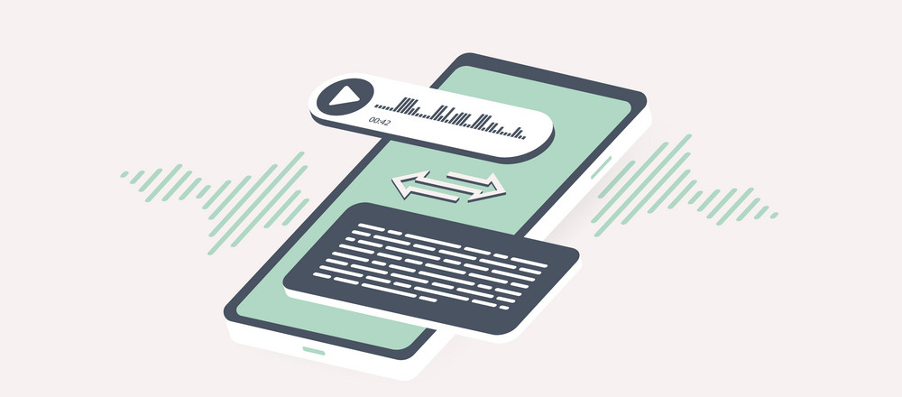

# AI Audio Transcription and Summarization Application

 
 

 
 

This repository contains a Streamlit application that leverages the OpenAI Whisper Audio Transcription Library and OpenAI's API to provide audio transcription and AI summarization services. With this app, you can easily transcribe audio and generate AI-powered summaries based on your specified context and requirements.

## Table of Contents
- [Project Overview](#project-overview)
- [Features and Future Features](#features)
- [Usage](#usage)
- [Repo Structure](#repo-structure)
- [Iterations](#iterations)
- [Demo](#demo)

---

## Demo of Current Iteration

A video of the MVP can be found here:

<iframe width="560" height="315" src="https://www.youtube.com/embed/LYLPVzuD6Dw" frameborder="0" allowfullscreen></iframe>

## Project Overview and Motivation

This project came about from a personal need: I was tired of taking notes. 

Whether it is business meetings, lectures, trainings, or even sessions of dungeons and dragons, even the few seconds it would take to jot things down would always take me out of the flow of the learning process. I wanted a way to record audio and then have it automatically transcribed and summarized so that I could focus on the experience and the learning process and leave the note-taking to the AI.

With all of the computational problems that can be solved with AI, I figured that this was a problem ripe for being solved with LLM's. I started looking into audio transcription and summarization libraries and found that OpenAI had recently released their [Whisper library]. I had had experience using Chat GPT (like i'm sure most people have) but thought it would be good to get some hands on experience using the API to make calls to GPT3 inside of an application. I decided to build a Streamlit application that leverages these two tools to provide audio transcription and AI summarization services.

## Features

#### Active Features

- **Audio Transcription**: The application uses the OpenAI Whisper Audio Transcription Library to transcribe audio files. Users can specify the audio file's context and any specific requirements they have for the transcript. The best part? This is totally open-source and doesn't require an API key.

- **AI Summarization**: After transcription, the app leverages OpenAI's GPT-3.5 model to generate AI-powered summaries of the transcribed content. Users can customize the summarization based on their preferences. Unfortunately, this does require an API key.

- **User-Friendly Interface**: The Streamlit interface makes it easy for users to upload audio files, set transcription preferences, and receive both the transcript and summary.

- **Flexible Configuration**: Users can specify the context in which the audio was recorded and tailor the summarization to meet their needs, whether it's for research, content creation, or any other purpose.

#### Wishlist Features (in order of priority)

- **Docker Container**: I would like to containerize this application so that users can easily run it locally without having to install dependencies. The only roadblock here is time, as I would need to learn how to create a Docker container and then test it to make sure it works.

- **Hosting on Streamlit Sharing**: I would like to host this application on Streamlit Sharing so that users can access it without having to clone the repo and run it locally. The only roadblock here is money, as I would need to upgrade my Streamlit Sharing account to a paid tier in order to host the application.

- **Audio Recording**: I would like to add the ability to record audio directly from the application so that users don't have to upload audio files. The only roadblock here is that I would need to learn how to record audio from the browser and invest time learning libraries that might be able to assist.

- **Open-Source LLM**: I would like to train an open-source LLM on audio transcription and summarization so that users don't have to use the OpenAI API. The roadblock here is a little more extensive, as preliminary testing with even the most advanced LLM's (Llama 2 70B) pale in comparison to the OpenAI API. I would need to invest time in training a model and then testing it to see if it is viable.

## Usage

#### Running the Application Locally

1. Clone the repository
2. Install the dependencies in `requirements.txt`
3. Run `streamlit run app.py`

#### Using the Application

1. Upload an audio file and click 'Transcribe Audio' and verify that the transcription is correct from the preview.
2. Navigate to the AI Summarization section and specify the context in which the audio was recorded and any specific requirements you have for the summary.
3. Click 'Generate Summary' and utilize the summary as needed

## Repo Structure

You are in the README.md file. The repo is broken down into the following structure:

- `README.md`: The README file for the repo. This file contains information about the project, how to use it, and how to run it locally.
- `streamlit_whisper.py`: The main application file. This is where the Streamlit application is defined and the OpenAI API is called.
- `requirements.txt`: The dependencies required to run the application.

## Iterations

#### Iteration 1: Running an LLM Locally

While the OpenAI whisper library is relatively lightweight and easy to install, LLM's continue to be cumbersome in size and difficult to run locally. I was able to get the application to run locally, but it was slow and the results were not great. I decided to pivot to using the OpenAI API to generate the summaries so the application would be more user-friendly and the results would be better.

#### Current Iteration: OpenAI API

I decided to use the OpenAI API to generate the summaries. This was a much better solution, as the results were much better and the application was much faster. The only downside is that it requires an API key, but I think that is a small price to pay for the benefits and there is a free trial that users can leverage.

